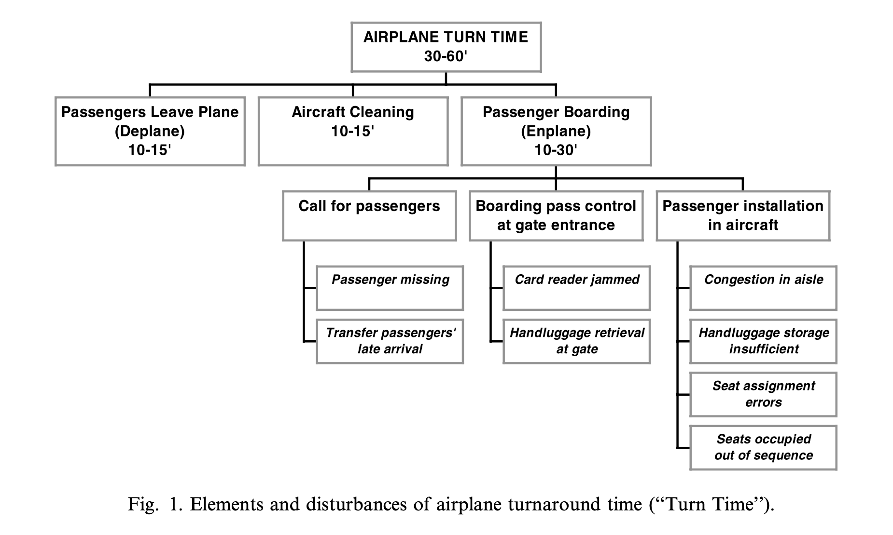
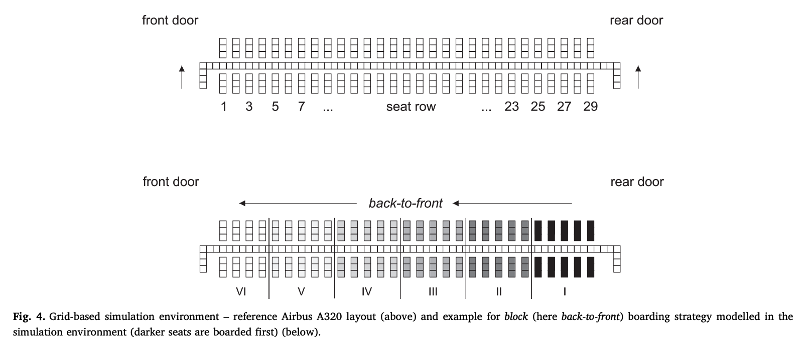
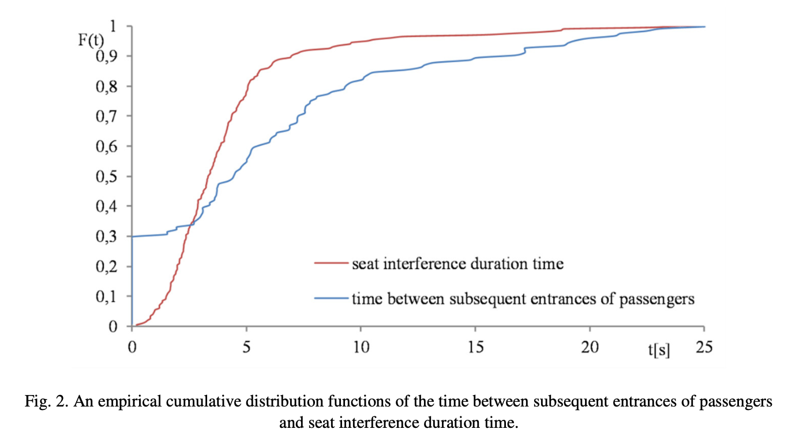
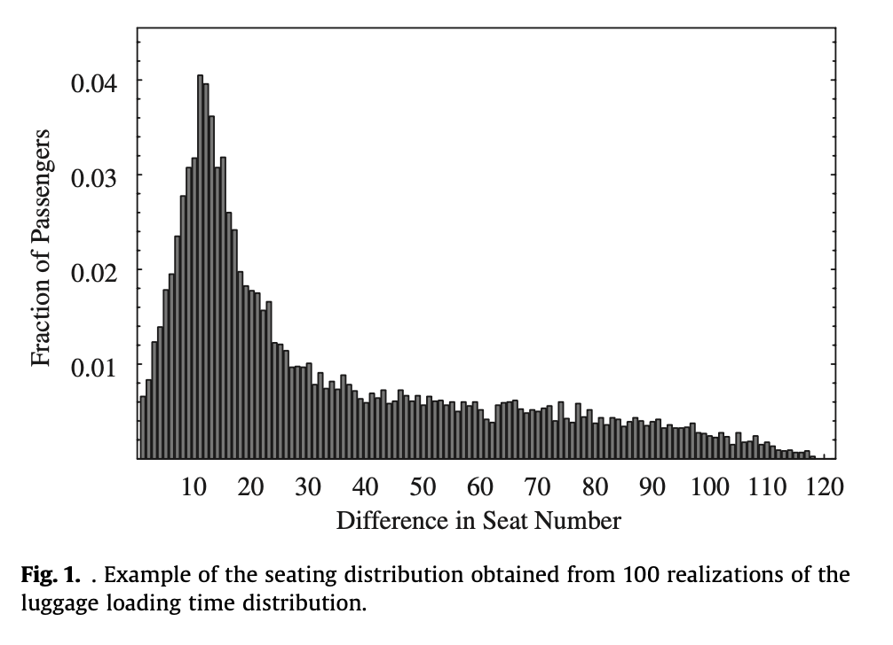
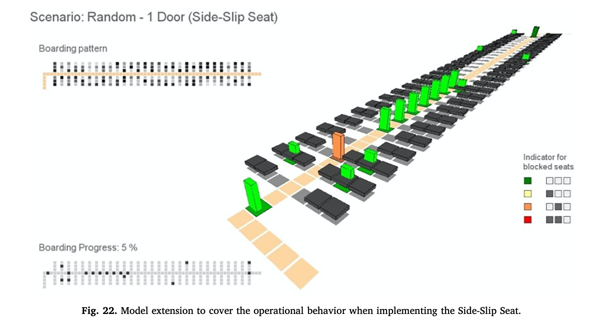

# Simulate boarding process

Author: Shan Yang, Wang Zilu

From: Department of Mangement Science and Engineering, Tongji University

E-mail: tjyangshan@gmail.com, prinway1226@gmail.com

## Usage

## Background

近年来，随着人民生活水平的提高，中国民航业迎来了飞速的增长， 2019年民航总营业额高达万亿。在民航业的增长大环境下，如何在有限的飞机资源、机场资源下，增加飞机周转率成为了一个非常重要的问题，应运而生了几个航空业的运筹问题，比如飞机排程问题（Aircraft Scheduling）、登机问题（Boarding Problem）等，妥善处理这些问题能够直接降低飞机的延误率，提高飞机的飞行时间。

我们所研究的问题便是登机问题（Boarding Problem）。根据EJOR的一份研究显示[1]，乘客登机时间可高达30分钟，在飞机清理完之后，需要乘客排队检票、直接或通过摆渡车登机、排队逐一登机并放置行李，如果不是头等舱，整个行李放置的过程也是非常恼人的，而且最终登机需要的时间无法确定，这就导致需要为乘客登机留有充足的时间。

而在民航业内的共识是，“飞机只有飞在天上才能够创造利润”，一个1500架次飞机每天的航空公司，能够为每班飞机节约一分钟，每年能够潜在增加收入数千万美元。所以，通过模式方式，降低乘客登机的期望时间、降低登机时间的期望方差，不仅能够提高乘客的登机体验，而且可以为航空公司获得大量的利润。

飞机登机过程本质上是人的行为交互过程，其核心的研究方法便是仿真实验，所以我们将对近年来通过仿真方法对飞机登机问题进行研究的部分论文进行综合的介绍，大致勾勒出登机问题的整个研究脉络和方法。

## How to simulate boarding

为了能够模拟乘客登机的过程，需要分别对飞机的宏观环境进行设置，并对乘客的微观行为进行仿真，以获得在特定的登机队列模型、特定的上座率情况下，登机的具体情况。

乘客的微观行为模拟问题上，由于飞机上乘客的行为被飞机座位的环境所约束，且有一定的规律性，即进入后先放置行李，再入座，可能需要已经落座的乘客让座，可能需要重新拿行李，其他的行为基本上不会影响登机的时间，所以登机过程的微观的乘客行为模拟比较简单。宏观场景主要关于飞机本身的环境，宏观参数则与实验相关，具体情况如下表。  

|              | 主要内容                                                     |
| ------------ | ------------------------------------------------------------ |
| 微观行为模拟 | 乘客速度模型、放置行李时间模型、座位交互时间模型、携带行李数目模型、偶发事件概率模型等 |
| 宏观场景模拟 | 飞机座位数目、舱门开放情况、过道数目等                       |
| 宏观参数设定 | 上座率、登机队列模型（如Back-to-Front，Random）              |

在设定好上述参数后，由于模型存在随机性，需要进行重复实验，统计最终的登机时间分布情况，同时，可以调整上座率、登机队列进行对照实验，通过调整其他微观行为的模型来检测某登机队列模型的稳健性（Robustness）

## History of research 

1998年Boeing发表了通过模拟方案解决登机问题的开山之作，提出了PEDS对乘客行为进行模拟，并对开放不同的舱门、简单的几个登机模型进行比较[2]，是采用仿真方式解决登机问题的开山之作；2002年，Landeghem通过模拟方式分析，建立了完整的启发式登机策略模型，并通过模拟方式对其进行了完整的测试[1]；2005年，Ferrari对Landeghem的实验进行了补充，建立了与实际情况相关的用户行为模型，并通过调整部分参数对登机策略的稳健性进行测试[3]。以上研究奠定了登机策略研究的基础。

登机策略优化方面，2005年，Steffen开启了通过优化算法获得登机策略的先河[4]，美国西方航空于2008年采用混合算法获得可行策略，并通过实地和模拟两种方式进行比较[8]，后续还有研究对Steffen进行了修正，如2014年Milne所做的研究[5]，或者通过LP等策略获得登机模拟[9]等。

行为模型方面，除了Boeing和Ferrari最初提出的方案外，Schultz 于2010年提出了基于客体运动的行为模型[11]；2012年Tang提出乘客属性对行为模型，并提出了新的登机策略[14]；2017年Kierzkowski第一次通过统计方式对乘客的行为进行分析[6]。

实验统计方面，每个实验都会提出基于其实验目标的统计方法，Bachmat也于2009年提出了分析仿真结果的统计模型[13]，Steffen于2012年也通过实地试验检验方案可行性[10]。

这便是通过仿真方式解决登机策略问题核心研究的大致脉络。

## Simluate passenger's behavior

### 2.2.1 如何进行行为模拟

​    乘客行为主要包括乘客速度、登机入口干扰（Entrance Interference）、座位干扰（Seat Interference）、放置行李（Bin Occupancy），以及诸如在前面乘客登机时后面乘客有多大的概率会直接通过、乘客行李携带数目、多大概率有乘客会迟到或早到等等，这些行为影响着模型的建立。

​    对乘客行为的模拟研究主要分为两个阶段，第一阶段以波音公司在1998年论文中提到的PEDS（Passenger Enplane/Deplane Simulation）为代表[2]，通过常用分布和周期性事件触发对乘客行为进行简单模拟，同时常用分布的参数设置也可以作为对照实验的扰动因素；第二阶段以Kierzkowski在2017年提出的模型为代表的经验分布模型[6]，该模型通过对登机过程中人的各类行为进行的综合统计获得。

​    由于登机模型相对简单，所以一般采用网格（Grid）来模拟乘客本身，再通过增加乘客行为，即可完整模拟[12]。

### 2.2.2 简单行为模拟

​    波音公司1994年第一次通过离散离散模型（Discrete Event Model）到乘客行为研究中，开发了PEDS。该模型将乘客的行为拆解为开始、移动、停止、等待、重新开始、结束几个基础的行为，由不同的事件触发。

对于乘客的行为具体模拟，分为偶发性事件和乘客行为属性。

PEDS通过周期性触发模拟偶发性事件，比如乘客等待站在走廊等待、帮助自己的家人、等待前面乘客放置行李等等，这些行为都是波音通过观察乘客行为获得；属性性质事件，比如走路速度、携带的行李数目、乘客放置行李时间、乘客之间位置交换时间等，PEDS通过将其分别分配到不同的分布上实现模拟，具体的分布有正态分布、三角分布、指数分布等。

后续的所有研究基本上基于此模型，即通过拆分乘客行为、周期触发事件、使用分布进行模拟等，或者对此模型进行了优化，比如Ferrari于2005年建立了行李数与放置时间的关系模型、交换位置与已落座乘客数目的关系模型，也建立了乘客迟到/早到的扰动因素[3]；Schultz于2010年提出的ASEP（Asymmetric simple exclusion process）模型[11]等。

|              | *Some  representative behavior models*                       |
| ------------ | ------------------------------------------------------------ |
| 1998 Boeing  | Passenger Enplane/Deplane Simulation model                   |
| 2005 Ferrari | Bin Occupancy  Model and Seating Model                       |
| 2010 Schultz | Discrete agent motion based on asymmetric simple exclusion process. |
| 2012 Tang    | Model based on passengers’  individual properties            |

*部分有代表性的行为模型*

### 2.2.3 经验统计

​    Kierzkowski于2017年首次通过经验统计方式，获得了乘客行为的分布情况，包括乘客在飞机上走路速度的准确分布、乘客进入飞机时的时间、乘客交换位置时的时间、乘客等待前方放置行李后再路过的概率、乘客放置行李的时间分布等。该分布结果通过对数千名乘客的录像观察获得，比单纯通过分布进行模拟更符合实际情况，在2017年后较多论文即开始基于此模型进行研究[12]。

​    

​    上述的研究基本上基于乘客的动态模拟，Tang对基于乘客个体属性的登机模拟也做了详细的研究[14]。

## Aircraft model

​    宏观环境主要包括飞机舱门个数、飞机座位数目、飞机座位布局、飞机过道数目等，而我们所参考的研究中，除了波音公司对舱门开放个数进行了研究[2]，其他全部采用的是下图所视单过道、三列座位的基本布局，只对座位个数进行了调整。

*一般采用的飞机内部结构*

## Boarding Strategies

### 2.4.1启发式登机策略

​    启发式登机策略可以参考下图的主要包括随机序列、从后往前、按照Block分组、从窗户往走廊、倒金字塔型、指定位置等，下图[12]中对部分模型进行了说明，Landeghem 在文章中按照各种原则也提出了非常多的启发式模型并进行了试验[1]。

在登机过程中，也需要考虑实际的限制，比如头等舱、一致性概率（比如：旅行团）、上座率、分组情况（比如：家庭）。

### 2.4.2 通过优化算法获得登机策略

除了上述方案外，也可以通过MCMC（Markov chain Monte Carlo）等优化算法获得可行的登机策略，比如Steffen [4]就采用了MCMC算法获得最佳的座位差异个数，从而获得最优队列（下图），Nyquist [5]则对Steffen获得的方案进行了优化。

其他还有Bazargan通过线性规划获得登机模型[9]、美国西部航空通过混合算法进行分组获得可行策略[8]。

## Experiments

### 2.6.1 实验简介

​    在确定了宏观环境即飞机的条件后，选择通过经验分布或其他分布模拟乘客的行为，设置包括迟到、早到、协助放行李等偶然性事件导致的扰动或延时，最后设置采用何种登机策略，即可进行登机模拟（如下图[12]）。

由于模拟过程存在随机性，所以需要进行重复实验以检验模型的可靠性，同时也需要进行对照实验和稳定性实验。为了能够对仿真结果进行检验，部分研究人员也将模型其直接应用到机场进行实地试验，如Steffen于2012年做的实验验证[10]。

### 2.6.2 如何检验模型效果

​    由于模拟实验存在随机性，在确定了实验模型后（行为分布/宏观条件/登机策略），一般通过重复实验以检验一个模型的效果，获得的结果一般会呈现出正态分布。通过分析正态分布的方差、期望值、最值、置信区间以对模型进行综合评价，而不单单是看登机时间的期望值。具体的分析方式将在下一节进行说明。

### 2.6.3 如何进行对照实验

​    我们如果需要比较两种登机策略的效果，就需要对模型在各种情况下的表现进行全面的分析。而实际情况中，我们无法对全部的实验情况进行比较，所以一般过离散事件仿真的方式以实现目的。比如下图[5]即离散事件仿真的一个案例，通过设置不同的行为模型参数，枚举所有情况即可。

2.6.4 如何进行稳健性检验

​    稳健型检验的目的主要是检测一种登机策略，能否获得较为稳定、方差较小的实验结果。由于飞机登机过程中，可能会出现各类随机事件，同时乘客登机的行为模拟完全可能也不符合模拟分布，而飞机的登机时间需要按照最差情况进行安排的，否则乘客还未入座飞机已经起飞，所以需要保证登机时间的稳健性。

​    检验稳健性的主要途径有两个，首先，通过调整偶然事件的出现概率，比如调高迟到、协助放行李等的概率，其次，通过调整模拟行为的分布，比如降低乘客期望登机速度、降低乘客期望座位交换速度。检验这些参数的调整对最终登机时间分布的影响。

### 2.7.1 登机时间统计分析

*图一：**Steffen**对登机时间的重复实验结果* *图二：**Ferrari**对重复实验结果的统计分析（均值**/**最值**/**方差）*

​    在Steffen的研究中[4]，为了比较几种方式的优劣性，其采用了统一的乘客微观行为分布模型，在同样的宏观环境中进行重复实验，获得最终的统计时间分布。我们可以看到，方案一即Steffen登机策略效果最好，时间最短且方差最小；方案2即修正后的Steffen登机策略次优，方差比其他登机方案更小，且登机时间的期望值也更低。

​    Ferrari的实验的登机策略要多得多，所以该论文的实验中则直接采用比较方差、最值、期望值的方式，来比较方案的优劣。

​    后续的研究如果需要比较不同登机方案的优劣性，基本沿用了该策略，即比较分布、方差、期望、最值等。

### 2.7.1 不同上座率时的登机时间

​    Ferrari通过调整上座率，重复进行不同方案下的实验结果，计算其期望值并进行比较。其他试验如果需要计算在不同方案受某试验参数的影响，也基本会沿用该方式，进行离散的统计计算。

​    这便是进行仿真结果分析的两种手段，当然实际需要如何统计是按照实验目的来安排的，也不尽相同。不过Bachmat在其文章中对如何分析登机时间详细的介绍[13]，改文章发表在Operations Research。

## Futures Works

### Current Researchs

3.2.2 宏观条件设置有限：

相对而言，单过道登机与双过道登机会更加麻烦，而国内航线飞行时间短、机舱小，所以基本采用的都是单过道登机，相关研究也就理所当然几乎全部采用了单过道。不仅如此，大部分研究也都采用了单舱门、三过道，部分研究甚至全部考虑的是100%的上座率等等，这种宏观条件的考虑明显偏少，不过对应用的影响不算大。

3.2.3 缺乏执行条件

​    2005年Steffen提出的登机模型的模拟效果是最好的，但是由于需要指定整个的登机序列，该模型基本不具备执行条件。

同时，部分模型比如分组登机模型，能否在国内机场执行、有摆渡车的情况下又能否使用，实际上是未知的，毕竟国内的许多机场还没有达到饱和状态，边际效应的成本并不明显，所以大部分情况下采用随机登机。

3.3.4 考虑随机因素有限

​    我们参考的文献中，考虑的随机影响因素比如迟到、早到、协助放行李等等的内容，其实是非常有限的，人的行为往往比这些要更加的复杂，会有层出不穷的随机事件。如果能够完整的封装一个API，包括登机过程中可能出现的随机事件以及随机事件所会产生的人与人之间的影响，或许能够推动该领域发展。

### 4.1.1 指定非满座情况分组规划

​    据我们研究，现阶段的登机策略均只研究了登机过程中不同满座率的情况，而对于同一种满座率，乘客的座位都是随机生成的，这就导致登机策略不一定适合该上座情况。比如极端情况当飞机靠窗只坐了一个人时，仍然采用Windows-Middle-Aisle模型分三批上飞机就是多次一举。

​    但是国内很多飞机没法坐满，假设都是2/3的上座率，如何通过方针或规划算法，直接给出分组结果，按组登机从而实现时间的解决呢？

### 4.1.1 综合实时规划模型

​    机场登机开始时，对于经济舱而言，不一定全部乘客已经到了并准备好登机，同时航空公司根据后台的数据分析，也可以知道飞机上的旅行团、乘客年龄、是否有家庭/男女朋友，以此为基础，能否实时基于仿真或规划建立一个登机序列呢？理论上，该模型可以基于指定的非满座情况下的分组规划，调整后实现。3.2 论文不足

# 参考文献

[1] Van Landeghem, H., Beuselinck, A., Reducing passenger boarding time in airplanes: a simulation based approach. European Journal of Operational Research 2000, 142, 294–308.

[2] Marelli, S., G. Mattocks, and R. Merry. Racing the Clock: The Role of Computer Simulation in Reducing Airplane Turn Time. Aero Magazine, No. 1, 1998, p. 10. [www.boeing.com/commercial/aeromagazine](http://www.boeing.com/commercial/aeromagazine).

[3] Ferrari P, Nagel K. Robustness of efficient passenger boarding strategies for airplanes[J]. Transportation Research Record, 2005, 1915(1): 44-54.

[4] Steffen J H. Optimal boarding method for airline passengers[J]. Journal of Air Transport Management, 2008, 14(3): 146-150.

[5] Milne R J, Kelly A R. A new method for boarding passengers onto an airplane[J]. Journal of Air Transport Management, 2014, 34: 93-100.

[6] Kierzkowski A, Kisiel T. The human factor in the passenger boarding process at the airport[J]. Procedia Engineering, 2017, 187: 348-355.

[7] Nyquist D C, McFadden K L. A study of the airline boarding problem[J]. Journal of Air Transport Management, 2008, 14(4): 197-204.

[8] Van Den Briel M H L, Villalobos J R, Hogg G L, et al. America west airlines develops efficient boarding strategies[J]. Interfaces, 2005, 35(3): 191-201.

[9] Bazargan M. A linear programming approach for aircraft boarding strategy[J]. European Journal of Operational Research, 2007, 183(1): 394-411.

[10] Steffen J H, Hotchkiss J. Experimental test of airplane boarding methods[J]. Journal of Air Transport Management, 2012, 18(1): 64-67.

[11] Schultz M, Kretz T, Fricke H. Solving the direction field for discrete agent motion[C]//International Conference on Cellular Automata. Springer, Berlin, Heidelberg, 2010: 489-495.

[12] Schultz M. A metric for the real-time evaluation of the aircraft boarding progress[J]. Transportation Research Part C: Emerging Technologies, 2018, 86: 467-487.

[13] Bachmat E, Berend D, Sapir L, et al. Analysis of airplane boarding times[J]. Operations Research, 2009, 57(2): 499-513.

[14] Tang T Q, Wu Y H, Huang H J, et al. An aircraft boarding model accounting for passengers’ individual properties[J]. Transportation Research Part C: Emerging Technologies, 2012, 22: 1-16.