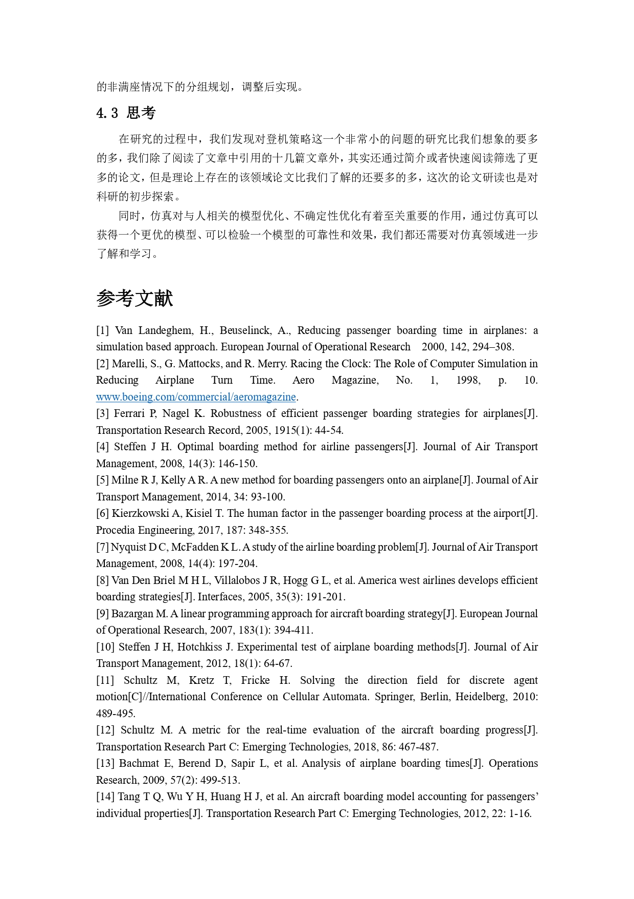

# Simulate boarding process

Author: Yang Shan, Wang Zilu

From: Department of Mangement Science and Engineering, Tongji University

Language: Python(SimPy)

E-mail: tjyangshan@gmail.com, prinway1226@gmail.com

## How to simulate boarding?

**The boarding problem is just like the queuing problem**. If the one at the front of the queue hasn't settled his luggage, people behind him must wait until he leaves the aisle.

However, there are also some differences between them. 

- There is only one queue in boarding problem and when the passengers will leave this queue depends on where his seat located.
- Passengers' interactive behaviors in boarding problem will be more complicated.
- etc.......

The queuing problem's model should be modified.

### Boarding Model

First of all, we should build a simulation environment. The most widely used model is the grid-based simulation environment. 

**In brief, this model assumes that there are many "counters" like grids. Passengers will move from one grid to  another and be "served" in every grid. Time costed depends on whether they only walk through the grid or they settle luggage in this grid.** 


### Passengers' Behavior 

There are many passengers'  behaviors. In our current work, we only handle some of them.

- **Seat interface**. When a passenger's seat is near windows(Seat C) and seat A or seat B has been seated by other passengers, they need to move to the aisle and wait for this passenger to be seated at seat C.

  

- **Passengers will be "served" at every grid and service time depends on their behaviors.** 


### Boarding Process

**First, we need to generate all passengers and randomly allocate seats to them.** Airbus A320 has 174 seats, so 174 passengers classes will be created, which record passengers' walking speed, carry their luggage or not, their seat number.

**Then, we need to set all grids as "counter" classes and link them as chains(all red line)**. After one passenger has been already served at one grid, he will check which grid he should move to next. For example, if his seat is on the left/right hand of his position, he will change to the short chain which contains his seat, otherwise, he will move to the next grid on this chain.


**Finally, passengers will be served at grids they pass by and the service time will be computed by passengers' properties such as their speed**. If the next grid they move to is occupied by other passengers, they will wait until it free.

## Simulation Test

```
...
Passenger14 enter the long grid02 at 327.20.
Passenger11 leaves the short grid00 at 331.03.
Passenger11enter the short grid01 at 331.03.
Passenger11 leaves the short grid01 at 332.03.
Passenger11enter the short grid02 at 332.03.
Passenger14 leaves the long grid02 at 332.72.
Passenger14enter the service grid at 332.72.
Settle luagge
Passenger17 enter the long grid02 at 332.72.
Passenger11 leaves the short grid02 at 339.34.
Passenger17 leaves the long grid02 at 339.41.
Passenger08enter the service grid at 339.41.
Settle luagge
Passenger14 leaves the service grid at 398.05.
Passenger14enter the short grid00 at 398.05.
Passenger17enter the service grid at 398.05.
Settle luagge
Passenger08 leaves the service grid at 399.14.
Passenger08enter the short grid00 at 399.14.
Passenger08 leaves the short grid00 at 400.56.
Passenger14 leaves the short grid00 at 403.95.
Passenger17 leaves the service grid at 407.70.
Passenger17enter the short grid00 at 407.70.
Passenger17 leaves the short grid00 at 408.60.
Passenger17enter the short grid01 at 408.60.
Passenger17 leaves the short grid01 at 410.16.
Passenger17enter the short grid02 at 410.16.
Passenger17 leaves the short grid02 at 412.80.

Number of passengers: 18
Boarding strategy: RANDOM
Total time: 6.880068467888844 min
```

## Paper(Chinese)


